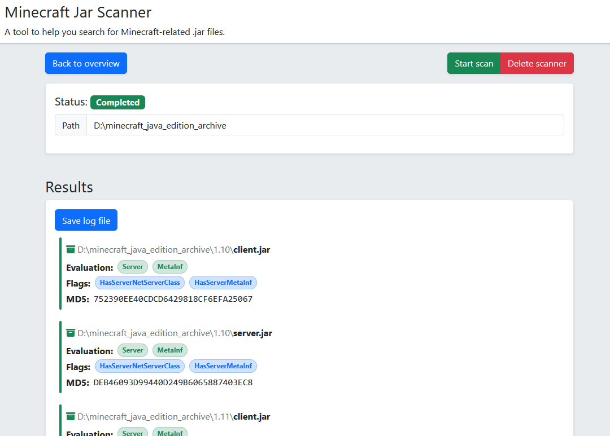
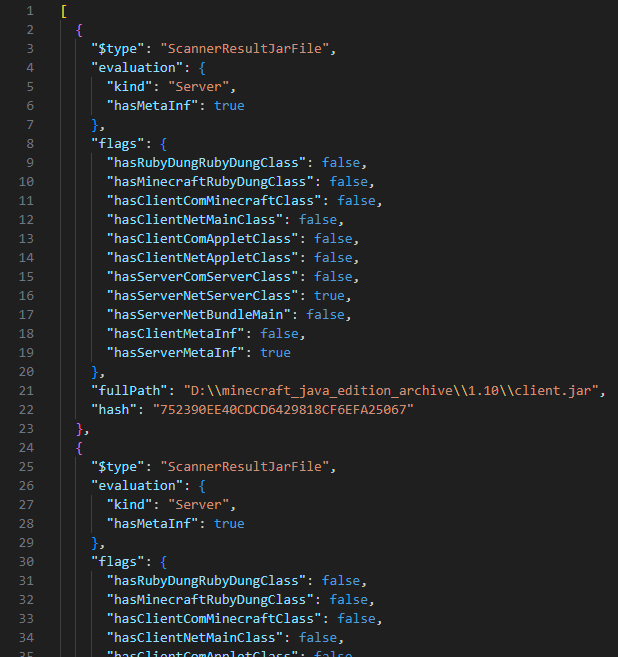

# Minecraft Jar Scanner

*A tool to help you search for Minecraft-related `.jar` files*

## Overview

Minecraft Jar Scanner is an application designed to scan your computer for Minecraft related `.jar` files.

The primary goal is to help search for potentially missing versions of Minecraft's client and server `.jar` files.

The application uses a web-based user interface (using [Bootstrap](https://dotnet.microsoft.com/en-us/apps/aspnet/web-apps/blazor)), hosted by a locally run web server (using [Blazor](https://aka.ms/blazor)). It does not send or receive any information over the Internet, it simply uses your web browser as its frontend.

You can also save the results of a scan to a [`.json`](https://en.wikipedia.org/wiki/JSON) file, which makes it easy to read exactly what the scan found and how it evaluated the files it found.

Note: The speed of the scan will depend on how many files are being scanned, as well as the physical storage media. Scanning for files on an [SSD](https://en.wikipedia.org/wiki/Solid-state_drive) will be signfiicantly faster than doing them same on a traditional [HDD](https://en.wikipedia.org/wiki/Hard_disk_drive).

## Usage

When starting the application, start by creating a new scanner. You can have multiple scanners if you wish to scan multiple directories simultaneously.

Then, specify the directory you want to scan, and click the "Start scan" button. The scan will then look for all `.jar` files in the specified directory (including `.jar` files located inside `.zip` files). It then performs some simple assertions to determine if the `.jar` file looks like a Minecraft-related `.jar` file, and evaluates what it things the `.jar` file is (client/server, and whether or not the expected `METAINF` exists).

Once the scan is completed, the results can be viewed on the scanner's page. This also includes the [MD5 hash](https://en.wikipedia.org/wiki/MD5) of the file, which can be used to compare it to other files.

Note: If you close the application, all scans are forgotten about. If you wish to save the results of a scan, make sure to press the "Save log file" button and save the file.

## Build from source

Before you can build this project from source, you need the [.NET SDK](https://dotnet.microsoft.com/en-us/download) installed.

You will also need to have [LibMan](https://learn.microsoft.com/en-us/aspnet/core/client-side/libman/libman-cli?view=aspnetcore-10.0) installed (alternatively, this functionality is also built into Visual Studio).

Once set up, do the following:

- Open a command-line shell
- Navigate to the `src/MinecraftJarScanner` directory
- Run `libman restore` (this downloads the frontend library files)
- Do one of the following:
  - To run in debug configuration: `dotnet run`
  - To build in debug configuration: `dotnet build` (the executable can then be found in `src/MinecraftJarScanner/bin/Debug/netX.X`)
  - To build in release configuration: `dotnet publish` (this is how the downloadable release is created, and embeds the necessary runtime into the executable)

## Q&A

**Q:** I have a bug/suggestion, what now?

- **A:** You are more than welcome to open an issue with your query, or if you want to contribute code, a pull request.

**Q:** Why is the program file so large?

- **A:** Rather than requiring you to install the [.NET runtime](https://dotnet.microsoft.com) separately, the program file includes the necessary runtime. This was done to avoid requiring the .NET runtime to be installed separately on your computer, but it does mean that the program file is correspondingly larger.

**Q:** Does this application change any of my files?

- **A:** No, it simply reads through the directories you tell it to search through (including checking inside of .zip files). It does not change any of the files it looks at.

**Q:** Why is the user interface accessed via a web browser?

- **A:** I mostly work with [Blazor](https://dotnet.microsoft.com/en-us/apps/aspnet/web-apps/blazor) these days, which I also chose to use for this application. I simply felt it was the easiest choice for me to writing a user interface in.

**Q:** Does this application gather any personal data or telemetry?

- **A:** No, none of your personal data is gathered or sent anywhere. Do note though, that if you save a log file after a scan, it will contain the full paths of the files it found, which may contain things like your local username that might be considered sensitive data. You should therefore read these files through before sending them to anyone, in order to make sure that you are not sending any information that you might not wish to share with others.

**Q:** Does this work on macOS/Linux?

- **A:** I haven't tested it, but there is nothing about this application that is inherently Windows-only, so it should work cross-platform. Though you will need to build the application from source for your particular platform.

## Disclaimer

This project is in no way affiliated with Mojang Studios, Microsoft, or any of their partners.

This project does not contain any of Minecraft's source code or assets. I do not claim any legal ownership over Minecraft, its assets, or any other related content.

## License

[MIT license](./LICENSE)
